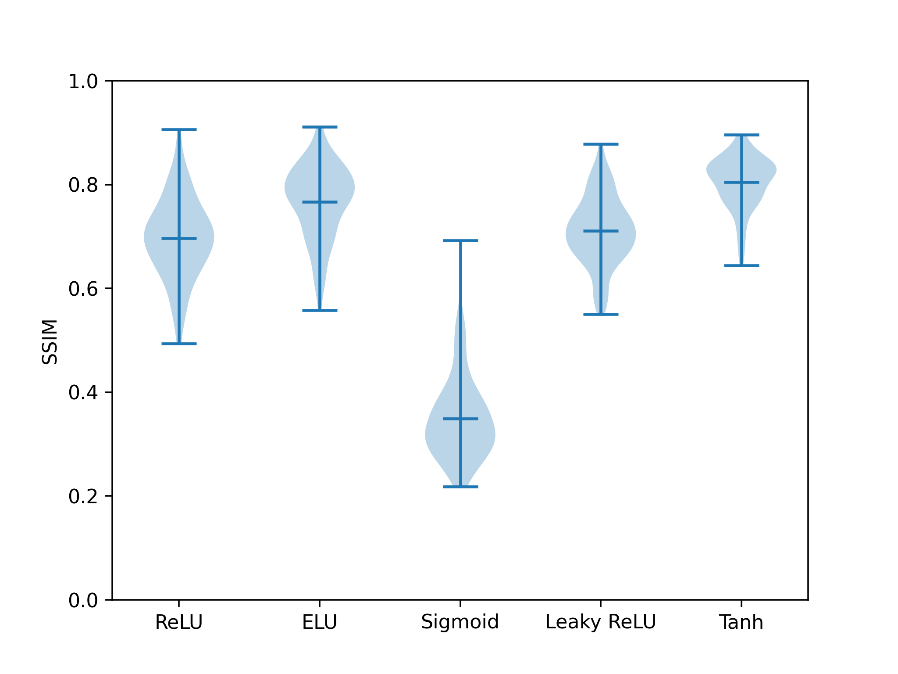
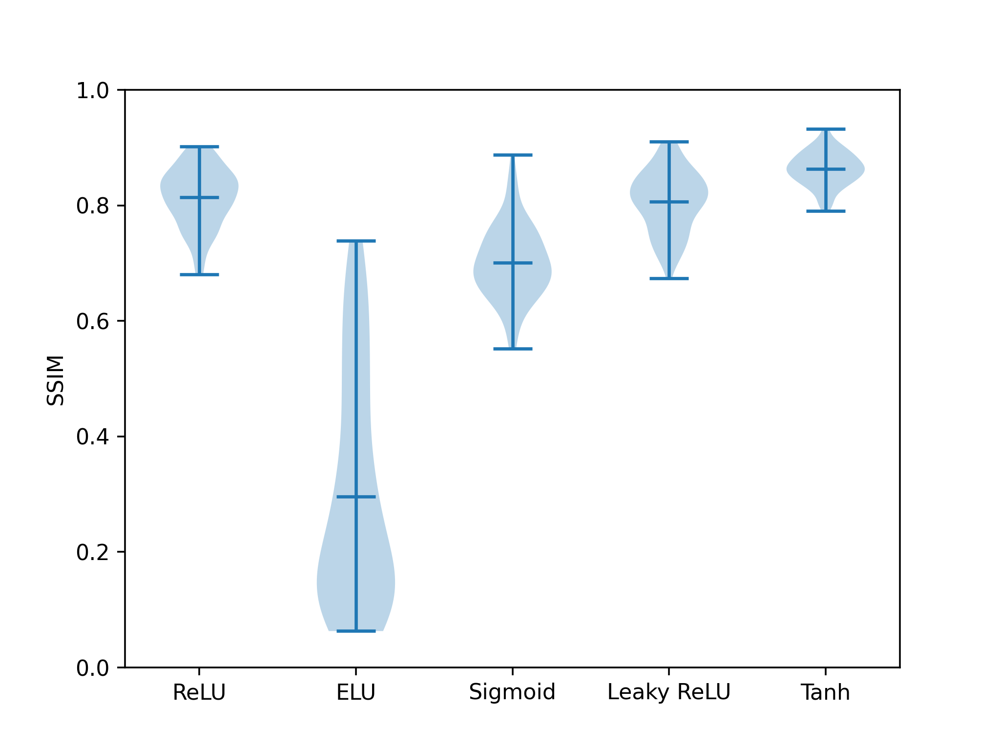
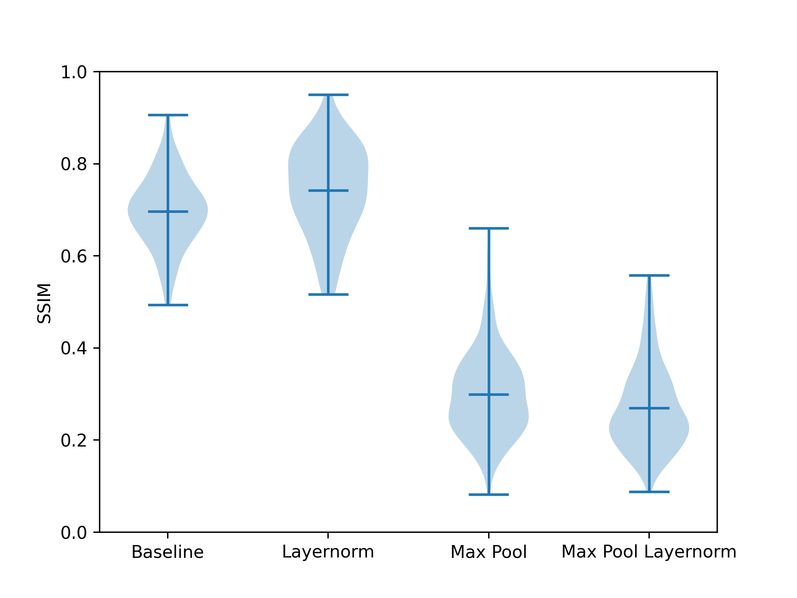
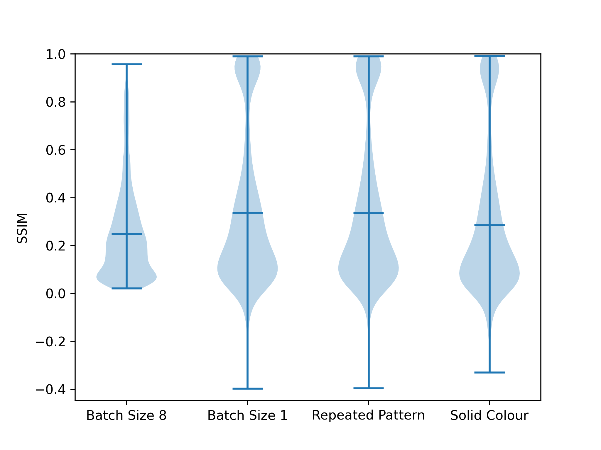

# Datasets

In this section we provide brief descriptions of the datasets that we have used in our experiments. For all datasets we preprocess the images by first standardizing from the byte-per-pixel-channel format to floating points in the range $[0, 1]$ for each pixel-channel by an element-wise division by $255$. We then cast each sample into a 3D array with the channels placed last, that is, $height \times width \times channels$.

## Fashion-MNIST

Fashion-MNIST https://arxiv.org/abs/1708.07747 was created as a drop-in replacement for the immensely popular MNIST dataset https://ieeexplore.ieee.org/document/726791, and has equivalent structure while providing a more complex learning task. The dataset is composed of 70 000 grayscale images with $28 \times 28$ pixels, where each image belongs to one of ten classes, in this case denoting the item of clothing the image is made of (e.g. trouser or dress). 60,000 of these images are in the training dataset, and the other 10,000 in the testing dataset.

## CIFAR-10

CIFAR-10 https://www.cs.toronto.edu/~kriz/cifar.html is an object classification dataset composed of 60,000 RGB color images with $32 \times 32$ pixels, with 50,000 samples in the training dataset and 10,000 in the testing dataset. It was created as a subset of the tiny images dataset (The tiny images dataset was formally withdrawn as specified at https://groups.csail.mit.edu/vision/TinyImages/), where reliable class labels are ensured for improved learning quality. The dataset has 10 classes, where each sample is labeled with the one it is an image of (e.g. cat, ship, airplane, etc.).

## CIFAR-100

The CIFAR-100 dataset https://www.cs.toronto.edu/~kriz/cifar.html is the same subset of the 80 million tiny images dataset as the CIFAR-10 dataset, except it is divided into 100 classes instead of 10. This task of object detection provides an even more complex task of image classification.

## SVHN
SVHN http://ufldl.stanford.edu/housenumbers/nips2011_housenumbers.pdf is a digit recognition dataset similar to the MNIST dataset https://ieeexplore.ieee.org/document/726791, while providing a significantly harder learning task by using images obtained from real-world house numbers with various natural scenes. We use the cropped digits format of the dataset, which is composed of 99289 RGB color images with $32 \times 32$ pixels, where training dataset contains 73257 samples and the testing dataset contains 26032 samples. Each sample is labeled with one of 10 classes stating which digit is contained in the respective image.

## Tiny-ImageNet

The Tiny-ImageNet dataset http://arxiv.org/abs/1707.08819 is a variant of the ImageNet dataset https://ieeexplore.ieee.org/document/5206848 that has been downsampled to a resolution of $64 \times 64$ RGB images. Where the original ImageNet is composed of images scraped from the Internet that represent 200 classes, from important nouns from the WordNet hierarchy. On average each class is represented by 1000 images. This presents a large and complex task.


# Projected Gradient Descent

Unless stated otherwise, we have used the projected gradient descent algorithm https://arxiv.org/abs/1412.6572 as an adversarial training step each epoch of training in each experiment. For this algorithm, we set the maximum amount of perturbation in $L_infty$ norm, $\epsilon = \frac{4}{255}$, the learning rate, $\eta_{pgd} = \frac{2 \epsilon}{3}$, and the number of steps, $S = 3$. The specific algorithm we have used is demonstrated below.

```go
function PGD(objective function evaluated with the current model F(theta; x, y), maximum amount of perturbation epsilon, learning rate eta, number of steps S, minibatch samples X, minibatch labels y) {
  pgd_X[0] := X
  foreach(step s in 1...S) {
    g_s := gradient(F, with_respect_to=pgd_X[s - 1])(theta, pgd_X[s - 1], y)
    pgd_X[s] := pgd_X[s - 1] + eta * sign(g_s)
    pgd_X[s] := clip(pgd_X[s], X - epsilon, X + epsilon)
  }
  return pgd_X[S]
}
```

# Proof of Statement in Section V

In Section V we make the following statement,

$$\frac{1}{\sqrt{|C|^{-1} \sum_t \sum_i g_{t, i}^2}} \leq \frac{1}{\sqrt{\sum_t (|C|^{-1} \sum_i g_{t, i})^2}}.$$

This can be proven directly as follows.

First we take the reciprocal of both sides,

$$\sqrt{|C|^{-1} \sum_t \sum_i g_{t, i}^2} \geq \sqrt{\sum_t (|C|^{-1} \sum_i g_{t, i})^2}.$$

Then we observe the constant, $|C|^{-1}$, which can be directly drawn out of the surd on the left hand side, and can be first extracted from the parenthesis on the right hand side,

$$\sqrt{|C|^{-1}} \sqrt{\sum_t \sum_i g_{t, i}^2} \geq \sqrt{\sum_t |C|^{-2} \sum_i g_{t, i}^2}.$$

The constant, $|C|^{-2}$, on the right hand side can be drawn out of surd,

$$\sqrt{|C|^{-1}} \sqrt{\sum_t \sum_i g_{t, i}^2} \geq \sqrt{|C|^{-2}} \sqrt{\sum_t \sum_i g_{t, i}^2}.$$

Finally, both sides can be divided by the $\sqrt{\sum_t \sum_i g_{t, i}^2}$ term to result in,

$$\sqrt{\frac{1}{|C|}} \geq \frac{1}{|C|}.$$

Where the equation above holds true since there will always be one or more clients in an operational system.

# Inversion Ablation

The following are plots of an ablation of training hyperparameters considering the effectiveness of representation inversion.

Firstly a comparison of activation functions,



then a comparison of activation functions with more training and larger learning rate,



then a comparison of usage of normalization and pooling,



and finally a comparison of different attack hyperparameters,



In our experiments, we found that that different neural networks were more or less susceptible to inversion attacks according to a number of hyperparameters such as layer types and activation functions. However, their precise effects remain ambiguous. In this section, we have performed an empirical study comparing the impact of those hyperparameters, and combinations thereof, upon the effectiveness of inversion attacks. In our experiments, we use a modified baseline CNN architecture containing three convolutional layers with $3 \times 3$ kernel shapes, $\{48, 32, 16\}$ channels respectively, same size padding, and ReLU activation. If there is normalization, it is applied prior to activation and pooling if present is done afterward. The model was trained over 10 full passes over the CIFAR-10 dataset with a mini batch size 8 using the SGD optimizer with learning rate 0.001. With this trained model, we performed the representation inversion attack 100 times each with unique seeds for random number generation. For the attack, we used the Lion optimizer with a learning rate of 0.01, starting with an uniformly random value from the range $[0, 1]$ for our recreated data. When the optimisation step of the attack was complete, we clipped the recreated data, $z$, into the range $[0, 1]$ with the element-wise function of $\min(\max(z, 0), 1)$. We also tuned the brightness of the recreated data to be the same as the average brightness of the standard test dataset for CIFAR-10, and took the best scoring among the tuned and untuned recreated data.

To measure the effectiveness of the attacks, we evaluated the structural similarity (SSIM) and peak signal-to-noise ratio (PSNR) between the recreated data and its ground truth. Since we found that there is a very strong correlation between SSIM and PSNR (Pearson correlation co-efficient of 0.747), we focused on the SSIM due to its more easily understandable rule of thumb that a value greater than 0.5 is recognizable as the original image.
% Maybe worth noting that large single colour blocks can fool the rule of thumb

We found that in modifying only the activation function, or even adding in a normalization layer, there is little impact on the effectiveness of the attack with the exception of the sigmoid function. When using the sigmoid activation function, the SSIM due to attack is only on average $0.35$, while for all others, including with normalization, it is approximately $0.82$. However, we noticed that with the sigmoid function, the model only attained a testing accuracy of 35\%, while the others attained approximately 59\%. This led us to evaluate the sigmoid model after training for 20 more full passes of the dataset, where it attained an accuracy of $52.93\%$ and an average structural similarity of $0.6$. This showed the susceptibility of neural network models with respect to differing activation functions and the usage of normalization is primarily related to the accuracy it attained through training, and not due to the choice of hyperparameters themselves.

This pattern does not hold true when pooling is used within models, where these models can attain high accuracies, in addition to attaining lower SSIM values. This is likely due to the nature of these operations, as they summarize windows of the input according to some function such as max or average, thereby confusing the inversion attack.

A summary plot of our results is shown in images at the start of this section. This plot shows the distribution of SSIM values against the various neural network hyperparameters after 10 full data passes of training.

We also performed the same experiments of attacks on the same trained models, but against a gradient computed using a single random training data sample. The same general patterns arise in this case, although, successful cases of inversion tend to attain improved results, and the choice of activation function becoming more significant, with tanh and leaky ReLU being significantly more  susceptible to gradient inversion.

Additionally, we performed our same experiments using differing initialization functions on the dummy data. Namely, instead of using uniform random generation, we use repeated pattern https://link.springer.com/chapter/10.1007/978-3-030-58951-6_27 where a randomly generated pattern is tiled into the starting image, and solid color https://link.springer.com/chapter/10.1007/978-3-030-58951-6_27, which as the name suggests, fills the entire image with a single color, in this case, red. We found that, with the repeated pattern initialization, the attack was more effective against models that use pooling, especially with average pooling (with a relatively small window size) and ELU activation where it achieves 0.531 and 0.469 SSIM, with and without normalization respectively. We see that solid color initialization does not improve attack performance, and in fact often reduces it.


# Experiment Results with Other Models

In this section, we present the experiment results for other neural networks models, namely LeNet for the Fashion-MNIST (FMNIST) dataset and ConvNeXt http://arxiv.org/abs/2201.03545 for the other datasets. Again, each of the batch normalization layers were replaced with layer normalization following the observations made in https://arxiv.org/abs/2210.03277.

Firstly, the inversion results:

| **Dataset** | **Algorithm** | **PSNR** | **SSIM** |
|-----|-----|-----|-----|
| FMNIST | FedAVG | 13.920023 | 0.444128 |
| | SecAdam | 12.415970 | 0.366750 |
| | DP-FedAVG | 13.318168 | 0.437378 |
| | **DP-SecAdam** | **11.772718** | **0.327700** |
| CIFAR-10 | FedAVG | 15.436438 | 0.221006 |
| | **SecAdam** | **14.784390** | **0.214058** |
| | DP-FedAVG | 16.082597 | 0.223207 |
| | DP-SecAdam | 15.960336 | 0.220189 |
| CIFAR-100 | FedAVG | 20.674564 | 0.608759 |
| | SecAdam | 15.563332 | 0.339200 |
| | DP-FedAVG | 20.203714 | 0.588081 |
| | **DP-SecAdam** | **13.304353** | **0.198929** |
| SVHN | FedAVG | 20.765010 | 0.452886 |
| | SecAdam | 20.866547 | 0.409335 |
| | DP-FedAVG | **20.104082** | 0.432747 |
| | **DP-SecAdam** | 20.680610 | **0.389017** |
| Tiny-Imagenet | FedAVG | 15.915026 | 0.305981 |
| | SecAdam | 14.720854 | 0.217874 |
| | DP-FedAVG | 15.797731 | 0.276312 |
| | **DP-SecAdam** | **13.202826** | **0.143757** |

While SecAdam and DP-SecAdam always attain better results in terms of reduced SSIM, we find that there are some cases where the attack does not perform well regardless of the training technique. These cases appear to be related to the the model being trained, namely, they only occur when ConvNeXt and LeNet models are trained. This correlates with our observation in the inversion ablation above where we see that different layer compositions in neural networks lead to different attack performance. Furthermore, there are other works in the literature that have made similar observations, e.g. Wei et al. https://link.springer.com/chapter/10.1007/978-3-030-58951-6_27. However, we note that the training models that are resistant to inversion attacks are not completely effective. For instance, in the case of CIFAR-100 with ConvNeXt. There are cases where the training conditions such as the dataset and the global batch size lead to sufficient conditions for effective attack despite model resistance. This further highlights the benefit of our algorithm, which improves resistance to gradient inversion in all the cases.

Next the performance results:

| **Dataset** | **Algorithm** | **Accuracy** | **Loss** |
|-----|-----|-----|-----|
| FMNIST | FedAVG | 79.4980% | 0.581885 |
| | SecAdam | 90.1820% | 0.284222 |
| CIFAR-10 | FedAVG | 39.2280% | 1.723099 |
| | SecAdam | 56.7180% | 1.236273 |
| CIFAR-100 | FedAVG | 2.6500% | 4.553232 |
| | SecAdam | 15.9940% | 3.689483 |
| SVHN | FedAVG | 19.1687% | 2.239945 |
| | SecAdam | 63.2583% | 1.140039 |
| Tiny-ImageNet | FedAVG | 0.7740% | 5.293410 |
| | SecAdam | 2.2600% | 5.025628 |

The results here hold the same pattern as with the models used in the main paper.

# SecLion

Since moment based updates confuse gradient inversion as proven in Section IV, we also propose a secure form of the Lion optimization algorithm https://arxiv.org/abs/2302.06675 at the client level in federated learning. This is given in the algorithm below. While this algorithm only uses a single moment value, and thus the gradient is separable using prior moments, we find that the usage of the sign function in the update enables privacy to be maintained. We followed a process similar to SecAdam, except in place of the second order moment, we generated random positive values. This enables the same gradient inseparability properties as with SecAdam, without changing the results attained from the algorithm since $\text{sign}(x) = \text{sign}(\frac{x}{y}), y > 0$.

```go
procedure SecLion(initial model theta[0], number of rounds R) {
  foreach(round r in 1...R) {
    foreach(client i in C) in parallel {
      theta[i, r, e] := theta[r]
      mm[i] := GenAddMask(i)
      mv[i] := GenAddMask(i)
      ss_i := U(1, Z)
      Securely send Enc(K_j; ss[i]) to all other clients j in C
      Receive and decrypt each other ss[j]
      s := SecretRecov(ss)
      mx := PRNG(seed=s, size=|theta[r]|)
      c[i] := ClientSecLion(i)
      permuted_c[i] := c[i] * mx + sum(over=(j in C, j != i), value=(indicator(i > j), mm[i, j]))
      m_vsum := sum(over=(j in C, j != i), value=(indicator(i > j), mv[i, j]))
      permuted_v[i] := uniform_random(epsilon_min, epsilon_max) * mx + m_vsum
    }
    c_sum := (1 / |C|) * sum(over=(i in C), value=permuted_c[i])
    v_sum := (1 / |C|) * sum(over=(i in C), value=permuted_v[i])
    theta[r + 1] := theta[r] - eta * sign((c_sum / v_sum) + lambda * theta[r])$
  }
}

function ClientSecLion(client id i) {
  foreach(epoch e in E) {
    g[r, e] := gradient(f)(theta[i, r, e])
    c[r, e] := beta1 * m[r, e] + (1 - beta1) g[r, e]$
    theta[i, r, e + 1] := theta[i, r, e] - eta[r, e] (sign(c[r, e]) + lambda * theta[i, r, e])
    m[r, e] := beta2 * m[r, e] + (1 - beta2) * g[r, e]$
  }
  
  return c[r, E]
}
```


# The Impact of DP on Performance

Performance results for various configurations of DP-FedAVG and DP-SecAdam are presented in tables below respectively. We have used the same settings as our performance experiments presented in Section VI.B. We see that, in both cases, a larger clipping threshold and smaller noise scale lead to an improved performance, since gradients are altered less. Additionally, we can see that the DP setting used in Section VI.A with clip threshold of 10 and noise scale of 0.001, has a minimal impact on performance in comparison to the algorithms without the DP.

Firstly the results showing the performance of the DP-FedAVG algorithm:

| **Dataset** | **Clip** | **Noise Scale** | **Accuracy** | **Loss** |
|-----|-----|-----|-----|-----|
| FMNIST | 1 | 0.001 | 47.3720\% | 1.709419 |
| | | 0.005 | 47.2840\% | 1.709231 |
| | | 0.01 | 47.1480\% | 1.709331 |
| | 5 | 0.001 | 60.0860\% | 1.172241 |
| | | 0.005 | 60.1020\% | 1.172059 |
| | | 0.01 | 60.1140\% | 1.171890 |
| | 10 | 0.001 | 62.1180\% | 1.117745 |
| | | 0.005 | 62.1420\% | 1.117787 |
| | | 0.01 | 62.1800\% | 1.117308 |
| CIFAR-10 | 1 | 0.001 | 27.1980\% | 2.005755 |
| | | 0.005 | 27.2060\% | 2.005672 |
| | | 0.01 | 27.1020\% | 2.006054 |
| | 5 | 0.001 | 38.9860\% | 1.674375 |
| | | 0.005 | 38.9580\% | 1.674334 |
| | | 0.01 | 38.9420\% | 1.675007 |
| | 10 | 0.001 | 42.5560\% | 1.569141 |
| | | 0.005 | 42.4700\% | 1.570619 |
| | | 0.01 | 42.4360\% | 1.573452 |
| CIFAR-100 | 1 | 0.001 | 1.1600\% | 4.691883 |
| | | 0.005 | 1.1760\% | 4.691944 |
| | | 0.01 | 1.1660\% | 4.691965 |
| | 5 | 0.001 | 1.8360\% | 4.590714 |
| | | 0.005 | 1.8200\% | 4.590707 |
| | | 0.01 | 1.8360\% | 4.590710 |
| | 10 | 0.001 | 2.8340\% | 4.555844 |
| | | 0.005 | 2.8160\% | 4.555801 |
| | | 0.01 | 2.8140\% | 4.555840 |
| SVHN | 1 | 0.001 | 19.4215\% | 2.230479 |
| | | 0.005 | 19.4269\% | 2.230473 |
| | | 0.01 | 19.4246\% | 2.230459 |
| | 5 | 0.001 | 22.2833\% | 2.206530 |
| | | 0.005 | 22.2887\% | 2.206541 |
| | | 0.01 | 22.3018\% | 2.206536 |
| | 10 | 0.001 | 25.1537\% | 2.179312 |
| | | 0.005 | 25.1575\% | 2.179319 |
| | | 0.01 | 25.1629\% | 2.179355 |
| Tiny-ImageNet | 1 | 0.001 | 0.5420\% | 5.426415 |
| | | 0.005 | 0.5400\% | 5.426518 |
| | | 0.01 | 0.5400\% | 5.426590 |
| | 5 | 0.001 | 0.5800\% | 5.338731 |
| | | 0.005 | 0.5820\% | 5.338745 |
| | | 0.01 | 0.5880\% | 5.338814 |
| | 10 | 0.001 | 5.700\% | 5.306952 |
| | | 0.005 | 0.5680\% | 5.306988 |
| | | 0.01 | 0.5820\% | 5.307005 |


Then the results showing the performance of the DP-SecAdam algorithm:


| **Dataset** | **Clip** | **Noise Scale** | **Accuracy** | **Loss** |
|-----|-----|-----|-----|-----|
| FMNIST | 1 | 0.001 | 77.3080\% | 0.644753 |
| | | 0.005 | 76.5540\% | 0.653533 |
| | | 0.01 | 76.0420\% | 0.674888 |
| | 5 | 0.001 | 77.7800\% | 0.617428 |
| | | 0.005 | 76.6320\% | 0.646476 |
| | | 0.01 | 77.5400\% | 0.636257 |
| | 10 | 0.001 | 77.9420\% | 0.609834 |
| | | 0.005 | 76.3700\% | 0.647844 |
| | | 0.01 | 76.1480\% | 0.664629 |
| CIFAR-10 | 1 | 0.001 | 55.3620\% | 1.275040 |
| | | 0.005 | 46.1580\% | 1.482428 |
| | | 0.01 | 41.1620\% | 1.587422 |
| | 5 | 0.001 | 61.5140\% | 1.261278 |
| | | 0.005 | 53.5140\% | 1.326430 |
| | | 0.01 | 50.4620\% | 1.398186 |
| | 10 | 0.001 | 61.9720\% | 1.359992 |
| | | 0.005 | 59.5580\% | 1.195372 |
| | | 0.01 | 54.7280\% | 1.288318 |
| CIFAR-100 | 1 | 0.001 | 16.5800\% | 3.584607 |
| | | 0.005 | 10.5040\% | 4.003648 |
| | | 0.01 | 7.5200\% | 4.208735 |
| | 5 | 0.001 | 20.8060\% | 3.375324 |
| | | 0.005 | 16.7580\% | 3.580310 |
| | | 0.01 | 14.0040\% | 3.738741 |
| | 10 | 0.001 | 21.5960\% | 3.315562 |
| | | 0.005 | 18.7160\% | 3.472931 |
| | | 0.01 | 16.7700\% | 3.580102 |
| SVHN | 1 | 0.001 | 76.2392\% | 0.759094 |
| | | 0.005 | 64.1557\% | 1.122426 |
| | | 0.01 | 51.7171\% | 1.461636 |
| | 5 | 0.001 | 79.8632\% | 0.658507 |
| | | 0.005 | 76.4828\% | 0.750793 |
| | | 0.01 | 73.2314\% | 0.841259 |
| | 10 | 0.001 | 80.6500\% | 0.633165 |
| | | 0.005 | 79.0619\% | 0.678637 |
| | | 0.01 | 76.4651\% | 0.749275 |
| Tiny-ImageNet | 1 | 0.001 | 4.6780\% | 4.806117 |
| | | 0.005 | 2.1300\% | 5.101195 |
| | | 0.01 | 1.5760\% | 5.203161 |
| | 5 | 0.001 | 6.9080\% | 4.605473 |
| | | 0.005 | 4.7160\% | 4.799801 |
| | | 0.01 | 3.6420\% | 4.934168 |
| | 10 | 0.001 | 7.5700\% | 4.538197 |
| | | 0.005 | 5.6480\% | 4.708279 |
| | | 0.01 | 4.5700\% | 4.809461 |

# iDLG and CPL Attack Results

Results of the experiments using the iDLG https://arxiv.org/abs/2001.02610 and CPL https://link.springer.com/chapter/10.1007/978-3-030-58951-6_27 gradient inversion attacks are shown in the table below.

\begin{table}
\centering
\caption{Inversion experiment results for the CPL and iDLG attacks.}
\label{table:extended inversion results}
\begin{tabular}{lllll}
\textbf{Dataset} | \textbf{Attack} | \textbf{Algorithm} | \textbf{PSNR} | \textbf{SSIM} |
|FMNIST} | \multirow{4}{*}{CPL} | DP-SecAdam | 14.770492 | 0.609941 | % CNN Model
| | | DP-FedAVG | 5.923473 | 0.093275 |
| | | SecAdam | 14.201989 | 0.583630 |
| | | FedAVG | 5.886303 | 0.089134 |
| | \multirow{4}{*}{iDLG} | DP-SecAdam | 14.770435 | 0.609465 |
| | | DP-FedAVG | 15.885258 | 0.599957 |
| | | SecAdam | 14.535288 | 0.610400 |
| | | FedAVG | 14.956824 | 0.557471 |
% FMNIST | LeNet | CPL | DP-SecAdam | 12.484128 | 0.414067 |
% FMNIST | LeNet | CPL | DP-FedAVG | 5.051741 | 0.110430 |
% FMNIST | LeNet | CPL | SecAdam | 11.567043 | 0.363821 |
% FMNIST | LeNet | CPL | FedAVG | 4.939874 | 0.113724 |
% FMNIST | LeNet | iDLG | DP-SecAdam | 13.827465 | 0.502846 |
% FMNIST | LeNet | iDLG | DP-FedAVG | 10.517620 | 0.320517 |
% FMNIST | LeNet | iDLG | SecAdam | 13.245315 | 0.480413 |
% FMNIST | LeNet | iDLG | FedAVG | 11.398240 | 0.357873 |
\multirow{4}{*}{CIFAR-10} | \multirow{2}{*}{CPL} | DP-FedAVG | 11.876072 | 0.143282 |
| | | FedAVG | 12.140654 | 0.127347 |
| | \multirow{2}{*}{iDLG} | DP-FedAVG | 15.250543 | 0.210011 |
| | | FedAVG | 14.612536 | 0.184445 |
\multirow{4}{*}{CIFAR-100} | \multirow{2}{*}{CPL} | DP-FedAVG | 12.393472 | 0.154556 |
| | | FedAVG | 12.462728 | 0.152147 |
| | \multirow{2}{*}{iDLG} | DP-FedAVG | 15.029755 | 0.250552 |
| | | FedAVG | 15.060930 | 0.248782 |
\multirow{4}{*}{SVHN} | \multirow{2}{*}{CPL} | DP-FedAVG | 13.459783 | 0.161448 |
| | | FedAVG | 13.441566 | 0.167241 |
| | \multirow{2}{*}{iDLG} | DP-FedAVG | 17.557103 | 0.365431 |
| | | FedAVG | 17.990578 | 0.368059 |
\multirow{4}{*}{Tiny-ImageNet} | \multirow{2}{*}{CPL} | DP-FedAVG | 11.481630 | 0.077327 |
| | | FedAVG | 11.533535 | 0.081349 |
| | \multirow{2}{*}{iDLG} | DP-FedAVG | 13.595315 | 0.169007 |
| | | FedAVG | 13.527347 | 0.166807 |
\end{tabular}
\end{table}
